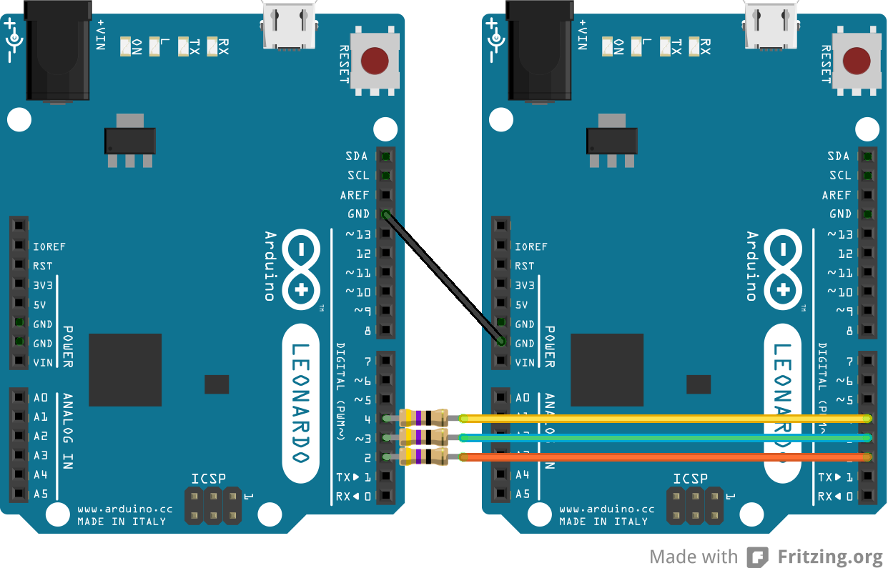

DSA
===

Arduino library for the CD-Pro2 DSA protocol
--------------------------------------------

The high-end Compact Disc modules (CD-Pro2, CD-Pro2M and CD-Pro2) made by [daisy-laser] (http://www.daisy-laser.com) are controlled by this DSA protocol.
A three wire interface using a data- (DSA), strobe- (STB) and acknowledge (ACK) line.
Read more about the [DSA protocol] (http://www.daisy-laser.com/technology/techdsa/techdsa.htm)

This is a small piece of work, that converts the DSA protocol assembler code from my [CDP-1 project](http://www.bergrans.com/cd-pro/index.php) into a simple library to control a CD-Pro2 with an Arduino board. Just for the fun of programming!

Installation
============
Download [the latest version] (https://github.com/martinvdberg/DSA/archive/master.zip) and unzip (atleast) the lib directory. Copy the unziped directory called "DSA" to the Arduino libraries folder. For OSX this is __~/Documents/Arduino/libraries/__ on Windows __My Documents\Arduino\libraries\__. More info about adding libraries to your Arduino IDE can be found [here] (http://www.arduino.cc/en/Hacking/Libraries).

Examples
========
SimpleCD
--------
Control your CD-Pro2M/LF unit by serial commands.

The following basic commands are implemented to get you going:
- t = Read TOC
- p = Play
- h = Pause
- s = Stop
- > = next track
- < = previous track

Check the [SimpleCD example] (https://github.com/martinvdberg/DSA/blob/master/lib/DSA/examples/SimpleCD/SimpleCD.ino). Good luck!

Ard2Ard
-------
Besides controlling a CD module this library can also be used to communicate between two Arduino boards. Load the example code in two Arduino boards, connect the three lines (with a 47Ohm resistor for safety) and the GND. Now open the serial-monitor on both sides and you are able to send text in two directions. Check the [Ard2Ard example] (https://github.com/martinvdberg/DSA/blob/master/lib/DSA/examples/Ard2Ard/Ard2Ard.ino).

